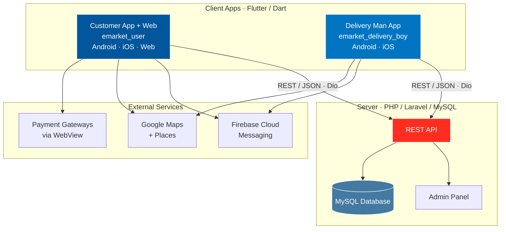

<p align="center">
  
</p>

<p align="center">
  
  
  
  
  
  
  
  
</p>

> **Developed by [Arslan Malik](https://github.com/arsalanmaalik461)**
> 📱 WhatsApp: [+92 300 8987448](https://wa.me/923008987448) · 🌐 Website: [arslanmalik.tech](https://arslanmalik.tech)

---

## 🌟 Executive Overview

**Multi Delivery App** is a complete multi-service delivery platform in a single repository: a PHP (Laravel) admin backend plus two production Flutter applications — a customer app that also builds for the web, and a dedicated delivery-rider app. Everything needed to launch a food, grocery and parcel delivery business is here, from the server install packages to the mobile apps and the incremental update files for version 6.2.1.

The customer app (`emarket_user`) covers the full ordering journey — browsing products and restaurants, cart and checkout, coupons, wishlist, address management with Google Places autocomplete, live order tracking on Google Maps, in-app chat, and push notifications powered by Firebase. The delivery man app (`emarket_delivery_boy`) gives riders their own workspace: order dashboard, live route tracking, chat with customers, and instant push + vibration alerts for new jobs. Both apps are multi-language ready, theme-aware (light/dark), and built on a clean layered architecture with Provider state management and GetIt dependency injection.

The backend ships as ready-to-install archives — `Admin new install V6.2.1.zip` for fresh deployments and `Admin update to V6.2.1.zip` for upgrading older versions — so the whole stack (API, admin panel, database) can be set up on any standard PHP/MySQL host.

---

## 📑 Table of Contents

- [✨ Key Features & Highlights](#-key-features--highlights)
- [🖥️ Feature Showcase](#️-feature-showcase)
- [🏗️ System Architecture](#️-system-architecture)
- [🚀 Quickstart & Installation Guide](#-quickstart--installation-guide)
- [📂 Project Structure](#-project-structure)
- [🛡️ Security & Notes](#️-security--notes)

---

## ✨ Key Features & Highlights

| Feature | Description |
| :--- | :--- |
| 🛍️ Customer Ordering App | Browse restaurants/products, cart, checkout, search, categories, offers and banners (`emarket_user`, Flutter — Android, iOS & Web) |
| 🏍️ Delivery Rider App | Dedicated rider workspace: order dashboard, live tracking, chat and profile (`emarket_delivery_boy`, Flutter — Android & iOS) |
| 🗺️ Live Order Tracking | Google Maps + Geolocator powered maps, address picker and route tracking for customers and riders |
| 💬 In-App Chat | Real-time chat between customers, riders and support (chat providers + screens in both apps) |
| 🎟️ Coupons & Wishlist | Promo codes, discount offers, wishlist and product reviews built into the customer app |
| 🔔 Push Notifications | Firebase Cloud Messaging + local notifications with vibration alerts on new orders |
| 📲 OTP & Auth | Phone-based auth with PIN code fields, forgot-password flow and country code picker |
| 💳 WebView Payments | Payment gateways integrated through `webview_flutter` checkout flows |
| 🌍 Multi-Language | Full localization system with language assets and a language selection screen |
| 🌗 Light / Dark Theme | Theme provider with Rubik typography across both apps |
| 🖥️ PHP Admin Panel | Backend admin + REST API shipped as `Admin new install V6.2.1.zip` (fresh) and `Admin update to V6.2.1.zip` (upgrades) |
| 🔄 Incremental Updates | `Update files only for apps from 6.2 to 6.2.1` — only the changed app files, no full rebuild needed |

---

## 🖥️ Feature Showcase

### 1. Customer App — the complete ordering experience

> "Everything a customer needs, from first launch to doorstep delivery."

- Onboarding, welcome and auth screens with OTP verification (`pin_code_fields`) and country code picker
- Home, categories, search, product details, offers, banners, coupons and wishlist
- Cart → address (Google Places autocomplete) → checkout with WebView payments
- Live order tracking screen with Google Maps, plus order history and re-order
- In-app chat, notifications, support, profile and multi-language settings
- Compiles to Android, iOS **and** web from the same codebase (`google_maps_flutter_web`, `url_strategy`)

### 2. Delivery Man App — built for riders on the move

> "New order? The rider knows in seconds — then navigates straight to the customer."

- Auth and home dashboard with the rider's assigned orders
- Order management with status updates and live location tracking (`tracker_provider`)
- In-app chat with customers and support
- Firebase push notifications + vibration alerts so no order is missed
- Profile, language and theme settings in a lightweight, fast app

### 3. Real-time communication layer

> "Chat, push and maps — the three things that make delivery feel instant."

- `chat_provider` in both apps for customer ↔ rider messaging
- `firebase_messaging` + `flutter_local_notifications` for order status pushes
- `geolocator`, `geocoding` and `google_maps_flutter` for addressing, ETAs and tracking

### 4. Admin backend & versioned releases

> "Install once, update in place — the backend ships as ready-made packages."

- `Admin new install V6.2.1.zip` — full backend + admin panel for new deployments
- `Admin update to V6.2.1.zip` — upgrade package for older installations only
- `Update files only for apps from 6.2 to 6.2.1/` — changed Flutter files for the app-side upgrade
- Short install guide in `Readme.txt` at the repo root

---

## 🏗️ System Architecture



**How the layers fit together:** both Flutter apps talk to the Laravel backend over REST/JSON using Dio. State is managed with Provider and dependencies are injected with GetIt (`di_container.dart`). Each app follows a layered layout — `data` (datasource / model / repository) → `provider` → `view` — with shared `helper`, `localization`, `theme` and `utill` modules. Firebase handles push, Google Maps/Places handles everything location-related, and payments run through an embedded WebView checkout.

---

## 🚀 Quickstart & Installation Guide

### Prerequisites

- **Backend:** PHP 8.x, MySQL 8.x, Composer, a web host (or local stack like XAMPP/Laragon)
- **Apps:** [Flutter SDK](https://docs.flutter.dev/get-started/install) (Dart SDK `>=2.7.0 <3.0.0`), Android Studio / Xcode for mobile builds, Chrome for the web build
- A Firebase project (`google-services.json` / `GoogleService-Info.plist`) and a Google Maps API key

### Step-by-Step Installation

**1. Install the admin backend**

```bash
# Fresh installation — extract ONLY the "new install" package on your server
unzip "Admin new install V6.2.1.zip" -d /path/to/public_html

# Then follow the bundled documentation:
#  - create a MySQL database and import the provided SQL file
#  - configure your .env (database credentials, app URL, mail, SMS gateway)
#  - point your domain to the extracted folder and complete the web installer
```

> Upgrading an older version instead? Use `Admin update to V6.2.1.zip` — never for a fresh install. (See `Readme.txt`.)

**2. Configure and run the customer app (Android / iOS / Web)**

```bash
cd "User app and web"

# Point the app at your backend
# → edit the base URL in lib/utill/app_constants.dart
# → add your Google Maps API key (android/app/src/main/AndroidManifest.xml, ios/Runner/AppDelegate, web/index.html)
# → place google-services.json (Android) and GoogleService-Info.plist (iOS)

flutter pub get
flutter run            # mobile
flutter run -d chrome  # web
```

**3. Configure and run the delivery man app**

```bash
cd "Delivery man app"

# Same three config steps as the customer app:
# base URL in lib/utill/app_constants.dart, Maps API key, Firebase files

flutter pub get
flutter run
```

**4. Apply the 6.2 → 6.2.1 app update (if upgrading)**

Copy the changed files from `Update files only for apps from 6.2 to 6.2.1/` over your existing app sources, then run `flutter pub get` again.

**5. Production builds**

```bash
cd "User app and web"
flutter build apk --release        # Android (customer)
flutter build web --release        # Web (customer)
flutter build ipa --release        # iOS (customer)

cd "../Delivery man app"
flutter build apk --release        # Android (rider)
```

---

## 📂 Project Structure

```
Multi-Delivery-app-/
├── Admin new install V6.2.1.zip          # Full PHP/Laravel backend + admin panel (fresh installs)
├── Admin update to V6.2.1.zip           # Upgrade package for older backend versions
├── Readme.txt                            # Short install notes (which zip to use when)
│
├── User app and web/                     # Customer app — Flutter (Android, iOS, Web)
│   ├── lib/
│   │   ├── main.dart                     # App entry point
│   │   ├── di_container.dart             # GetIt dependency injection setup
│   │   ├── data/                         # datasource · model · repository
│   │   ├── provider/                     # auth, cart, order, product, chat, coupon,
│   │   │                                 # location, wishlist, notification, theme, ...
│   │   ├── view/screens/                 # address, auth, cart, category, chat, checkout,
│   │   │                                 # coupon, dashboard, home, order, product,
│   │   │                                 # profile, search, support, track, wishlist, ...
│   │   ├── view/base/                    # Shared widgets
│   │   ├── helper/  localization/        # i18n, language assets
│   │   ├── notification/  theme/  utill/ # push setup, themes, constants & routes
│   │   └── assets/                       # icon · image · language · Rubik fonts
│   ├── android/  ios/  web/              # Platform shells (incl. web build support)
│   └── pubspec.yaml                      # emarket_user 1.0.0+1 — dio, provider, firebase,
│                                         # google_maps_flutter, webview_flutter, ...
│
├── Delivery man app/                     # Rider app — Flutter (Android, iOS)
│   ├── lib/
│   │   ├── main.dart
│   │   ├── di_container.dart
│   │   ├── data/                         # datasource · model · repository
│   │   ├── provider/                     # auth, order, tracker, chat, location,
│   │   │                                 # profile, notification, theme, ...
│   │   └── view/screens/                 # auth, chat, dashboard, home, order,
│   │                                      # profile, splash, language, ...
│   └── pubspec.yaml                      # emarket_delivery_boy 1.0.0+1 — maps, firebase,
│                                         # geolocator, vibration, image_picker, ...
│
└── Update files only for apps from 6.2 to 6.2.1/
    └── User app and web/                 # Changed app files for the 6.2 → 6.2.1 upgrade
```

---

## 🛡️ Security & Notes

- **Change all defaults on install:** the backend ships with installer defaults — set strong admin credentials, app keys and database passwords before going live.
- **Protect your `.env`:** never commit the backend `.env` or Firebase/Google Maps keys to a public repo; restrict API keys by platform and bundle ID in the Google Cloud console.
- **Use HTTPS everywhere:** the apps talk to the backend over REST — serve the API over TLS and keep the base URL in `app_constants.dart` on `https://`.
- **Firebase files are sensitive:** keep `google-services.json` / `GoogleService-Info.plist` out of public commits or use restricted keys.
- **Large archives:** the two admin zips are ~40 MB each and are committed as release artifacts — cloning downloads them in full.
- **Version note:** packages in this repo target **v6.2.1**; for app upgrades from 6.2 use only the files under `Update files only for apps from 6.2 to 6.2.1/`.
- **Documentation:** `Readme.txt` covers which package to use for fresh installs vs. updates; follow the bundled backend documentation for server-specific steps.

---

<p align="center">
  <sub>Developed with ❤️ by <a href="https://github.com/arsalanmaalik461">Arslan Malik</a> · 📱 <a href="https://wa.me/923008987448">WhatsApp: +92 300 8987448</a> · 🌐 <a href="https://arslanmalik.tech">arslanmalik.tech</a></sub>
</p>
